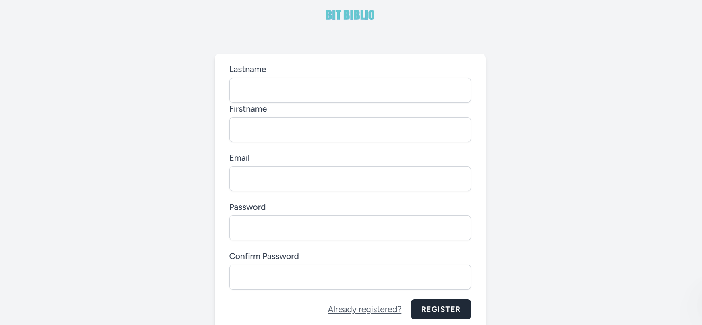

<p align ="center"><a href="https://laravel.com" target="_blank"></a></p>

# Laravel Library Management System

## Quick Start 
clone the repo
```
https://github.com/Dayende-ib/gestion-bibliotheque.git

```

change current directory

```
cd laravel-backend
```
install dependencies
```
composer install
````
install js dependencies
```
npm install && npm run dev
````
create .env file
```
cp (unix) or copy (Windows) .env.example .env
```
generate env key
```
php artisan key:generate
```
migrate the migration and seed the database
```
php artisan migrate:fresh --seed
```
start server
```
php artisan serve
```


# That's all 🎊🎉 

## ScreenShots
<br /> <br />
<br /> <br />
```
Make sure to leave a start ✨✨
```
